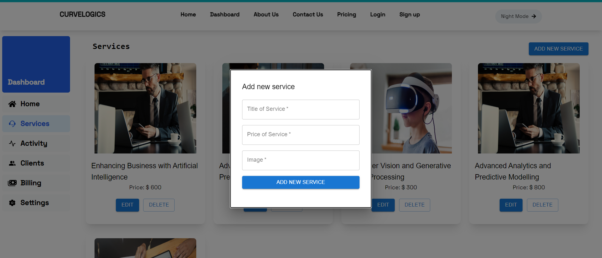
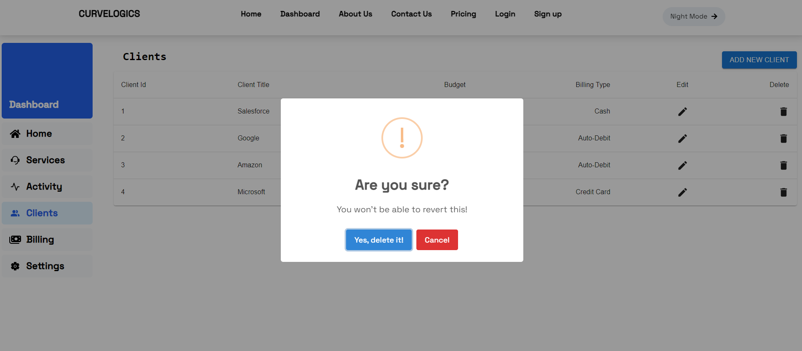

<h1 align="center">
🌐 React App
</h1>
<p align="center">
   <a href="https://github.com/amazingandyyy/mern/blob/master/LICENSE">
      
   </a>
   <a href="https://circleci.com/gh/amazingandyyy/mern">
      
   </a>
</p>

# CURVELOGICS Frontend Coding Assignment.

---

I created this website as a react assignment which given by Data Science Academy, basically showcasing my skills in frontend programming.

---

## Tech Stack

- ReactJs
- Javascript (ES6)
- TailwindCss
- React-Router-Dom@v6
- Material UI
- Material UI Icons

## Requirements

- For development, you will only need Node.js and a node global package, NPM, installed in your environement.

## Clone or Download

```terminal
$ git clone https://github.com/tarun-upadhyay/CURVELOGICS-frontend-assignment.git
$ yarn # or npm i
```

## Project structure

```terminal
frontend
    - package.json
    - src
        - index.js
        - App.jsx
     - Components
     - Pages

```

## Client-side usage(PORT: 3000)

```terminal
$ cd frontend          // go to frontend folder
$ yarn # or npm i     // npm install packages
$ npm start          // run it locally
```

## Glimpses

### Homepage


### Dashboard


### Service


- Add new Service



- Delete Service


- Edit Service


### Clients


- Add new Client


- Delete Client



### Contact Us


---

# Thank you for your time

- Thank you for using this application
- Feel free to ask any query.

[My Github](https://github.com/tarun-upadhyay)
https://github.com/tarun-upadhyay

[My Portfolio](https://tarun-upadhyay.github.io/)
https://tarun-upadhyay.github.io/

[Email ME](mailto:tarunu88@gmail.com)

---
